# Part 4: Tableau Dashboard - Sales Performance Analytics

**Student:** sknisreen  
**Student ID:** 2511813  
**Repository:** `sknisreen_2511813_part4_tableau_dashboard`

---

## Business Problem Summary

Leadership needs an interactive **sales performance dashboard** to monitor revenue, profitability, returns, delivery speed, and customer satisfaction across regions, segments, product categories, and marketing channels. The goal is to identify high-performing areas, operational bottlenecks, and return-risk categories to support data-driven decisions.

This part prepares the dataset, computes dashboard KPIs, builds exploratory visualisations (saved as screenshots), and exports a **Tableau-ready CSV** for dashboard development in Tableau Desktop.

---

## Dataset Used

| File | Description |
|------|-------------|
| `data/dashboard_sales_data.xlsx` | Raw sales orders (4,200 rows, 20 columns) |
| `data/dashboard_sales_prepared.csv` | Prepared export with derived fields for Tableau |

| Column | Description |
|--------|-------------|
| `order_id` | Unique order identifier |
| `order_date` / `ship_date` | Order and ship dates |
| `customer_id` | Customer identifier |
| `customer_segment` | Consumer, Corporate, or Home Office |
| `region` / `state` / `city` | Geographic hierarchy |
| `category` / `sub_category` / `product_name` | Product hierarchy |
| `ship_mode` | Shipping mode |
| `sales` / `quantity` / `discount` / `profit` | Financial metrics |
| `return_flag` | 1 if order was returned |
| `delivery_days` | Days between order and ship date |
| `customer_rating` | Customer rating (1-5) |
| `campaign_channel` | Acquisition/campaign channel |

**Derived fields (notebook):** `profit_margin`, `order_year`, `order_month`, `order_quarter`

**Missing values:** `customer_rating` (32), `campaign_channel` (24) - imputed in preparation step.

---

## Tools Used

- **Python 3.12**
- **Jupyter Notebook** - `part4_tableau_dashboard.ipynb`
- **pandas** - data preparation and aggregation
- **numpy** - derived field calculations
- **matplotlib & seaborn** - dashboard-style visualisations
- **openpyxl** - Excel read
- **Tableau Desktop** (recommended) - connect to `dashboard_sales_prepared.csv` for final interactive dashboard

---

## Steps Performed

1. Loaded `dashboard_sales_data.xlsx` from the `data/` folder.
2. Created derived fields: profit margin, order year/month/quarter.
3. Imputed missing `customer_rating` (median) and `campaign_channel` (Unknown).
4. Conducted EDA on sales, profit, discounts, and returns.
5. Computed executive KPIs (total sales, profit, margin, return rate, delivery, rating).
6. Analysed performance by region, customer segment, and category.
7. Evaluated campaign channel effectiveness and ship-mode delivery performance.
8. Built monthly trend charts for sales, profit, and return rate.
9. Analysed customer ratings and profit margin heatmap (region x category).
10. Identified top states by sales.
11. Exported `dashboard_sales_prepared.csv` for Tableau.
12. Saved all visualisations to `screenshots/`.

---

## Key Outputs

| Output | Location |
|--------|----------|
| Dashboard notebook | `part4_tableau_dashboard.ipynb` |
| Tableau-ready data | `data/dashboard_sales_prepared.csv` |
| Screenshots | `screenshots/*.png` |

**Executive KPIs (full dataset):**

| KPI | Value |
|-----|-------|
| Total Sales | ~217.0M |
| Total Profit | ~33.3M |
| Profit Margin | ~15.3% |
| Return Rate | ~4.5% |
| Avg Delivery Days | ~3.6 |
| Avg Customer Rating | ~4.06 |

**Screenshots:**

| File | Description |
|------|-------------|
| `eda_sales_profit_discount_returns.png` | Sales/profit distributions, discount, returns |
| `dashboard_executive_kpi_summary.png` | Executive KPI snapshot |
| `dashboard_sales_profit_by_region.png` | Regional sales and profit |
| `dashboard_segment_performance.png` | Sales/profit by customer segment |
| `dashboard_category_sales_and_returns.png` | Category sales and return rates |
| `dashboard_top_subcategories_sales.png` | Top 10 sub-categories |
| `dashboard_campaign_channel_performance.png` | Channel sales and profit |
| `dashboard_delivery_by_ship_mode.png` | Delivery performance by ship mode |
| `dashboard_monthly_sales_profit_return_trend.png` | Monthly trends |
| `dashboard_return_rate_by_region.png` | Return rate by region |
| `dashboard_customer_rating_by_channel.png` | Rating by campaign channel |
| `dashboard_profit_margin_heatmap.png` | Profit margin: region x category |
| `dashboard_top_states_sales.png` | Top 10 states by sales |
| `data_folder_screenshot.png` | Data folder and dataset overview |
| `kpi_step_screenshot.png` | KPI calculation step in the notebook |
| `output_cell_screenshot.png` | Notebook output cell screenshot |
| `sales_intermediate_step_screenshot.png` | Intermediate sales processing step |

---

## Business Insights

1. **South leads in sales and profit** among regions, followed by North and West.
2. **Technology dominates revenue** (~71% of total sales) and generates the highest absolute profit; Furniture has the highest return rate (~8%).
3. **Organic channel** drives the most sales (~89M) and profit; Referral has the highest return rate among channels (~6%).
4. **Home Office segment** slightly leads in sales and profit over Consumer and Corporate.
5. **Standard Class shipping** is slowest (~4.7 days avg) but most common; Same Day averages 0.4 days.
6. **Return rate** is relatively low overall (~4.5%) but varies by category - Furniture warrants dashboard alerts.
7. **Profit margin** differs by region and category - heatmap highlights where margin is strongest/weakest.
8. **Rajasthan** is the top state by sales volume.

### Dashboard recommendations

- Add **filters**: region, segment, category, campaign channel, date range.
- Use **KPI cards** for sales, profit, margin, returns, delivery, rating.
- Highlight **Furniture returns** with conditional formatting or alerts.
- Show **monthly trend** lines for sales/profit and return rate monitoring.

---

## Assumptions Made

1. `delivery_days` is pre-calculated as ship_date minus order_date in the source data.
2. Missing `customer_rating` filled with **median**; missing `campaign_channel` filled with **Unknown**.
3. Profit margin = profit / sales at order level.
4. Returned orders (`return_flag = 1`) are included in sales totals unless filtered in Tableau.
5. Screenshots represent dashboard prototypes; final interactivity is built in Tableau using the prepared CSV.
6. All monetary values are in the same currency unit as provided in the dataset.

---

## Known Limitations

1. **No live Tableau workbook (.twbx)** included - screenshots and prepared CSV support manual dashboard build.
2. **Imputation** of 56 missing values may slightly affect rating and channel aggregations.
3. **No geographic map** generated in Python - state/city map recommended in Tableau.
4. Analysis is **descriptive** - no predictive modelling or statistical testing applied.
5. **Duplicate customer orders** across time are not deduplicated - each row is one order line.
6. Short-term monthly fluctuations may reflect seasonality not fully decomposed in this notebook.

---

## Screenshots

Plots are saved in the [`screenshots/`](screenshots/) folder. See the table in **Key Outputs** for file names and descriptions.

### Rendered screenshots

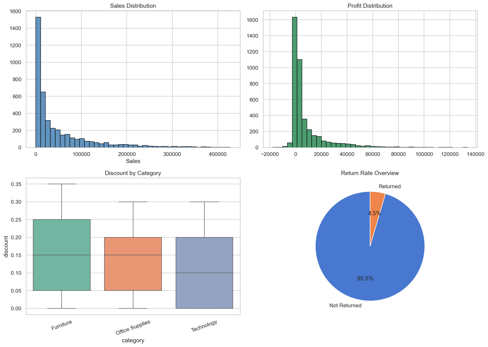

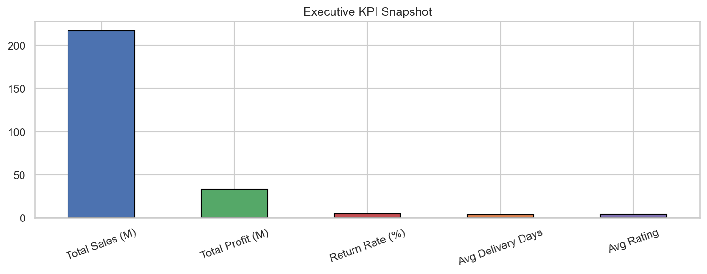

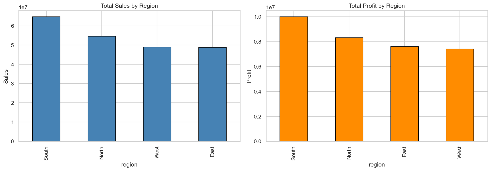

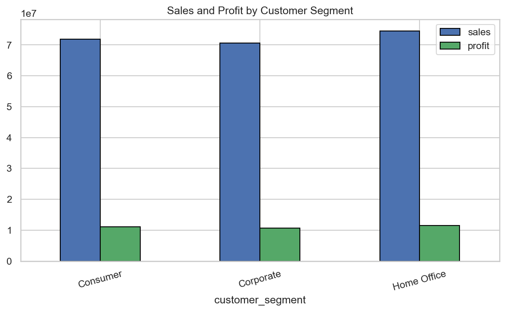

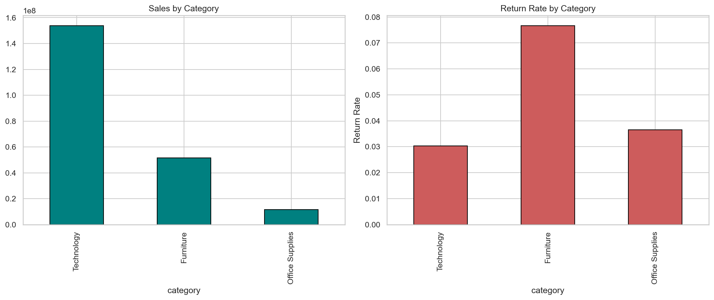

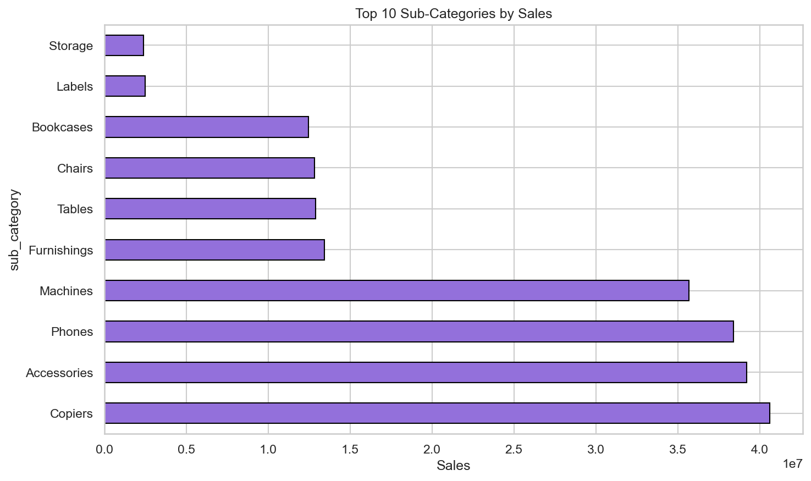

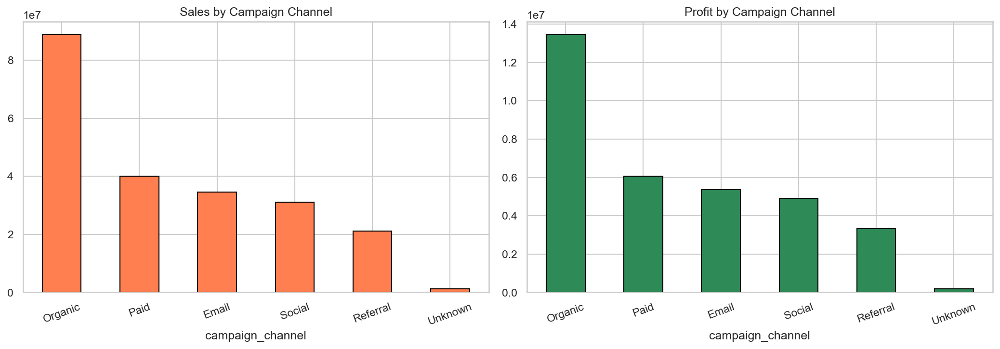

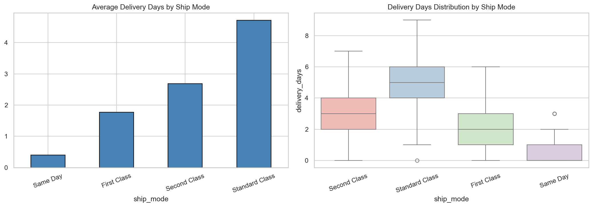

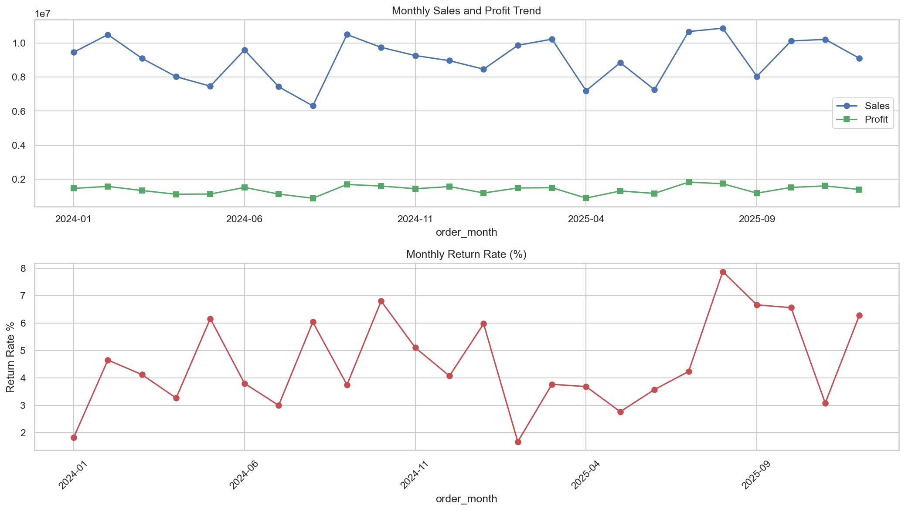

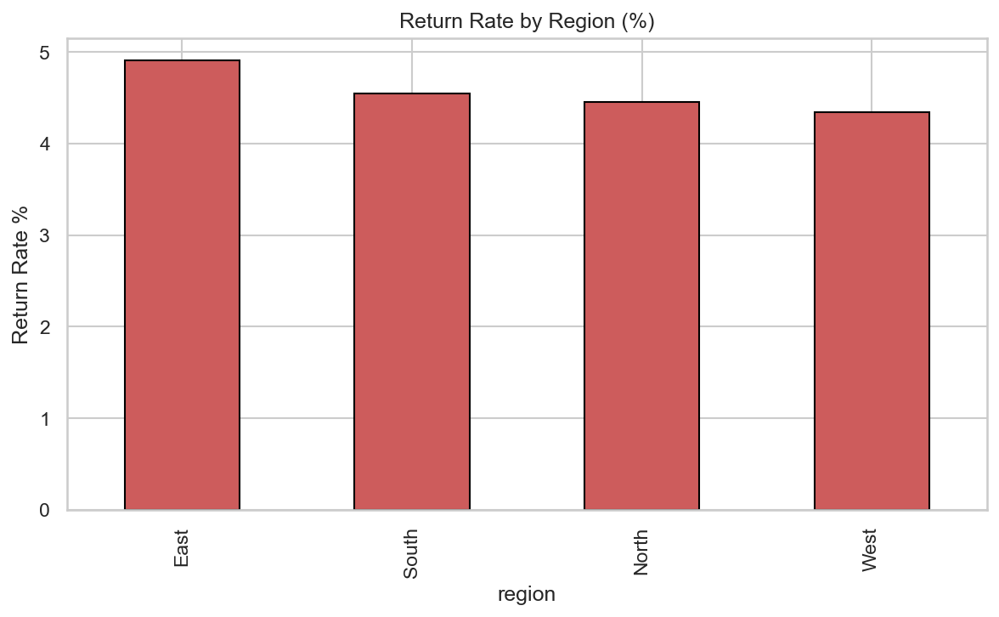

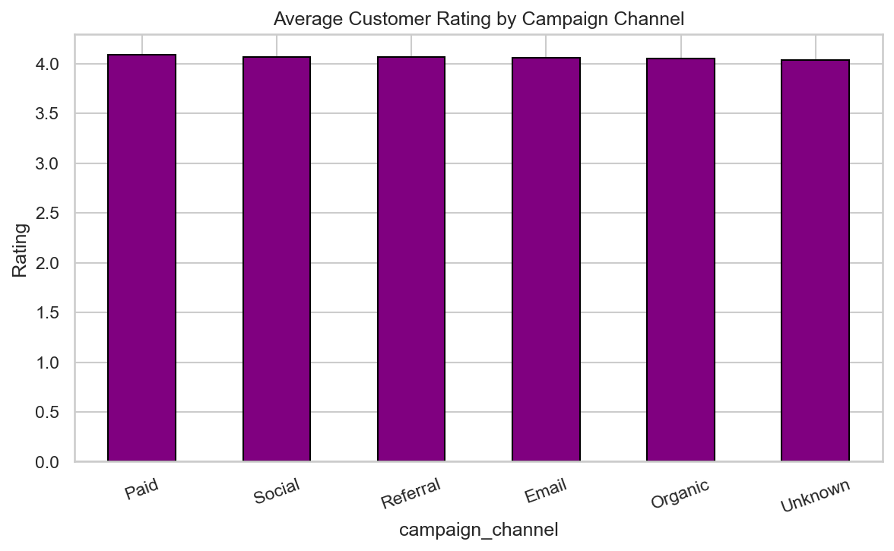

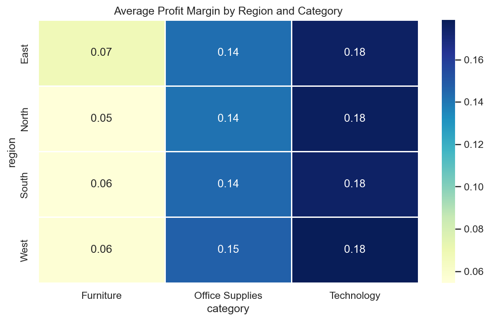

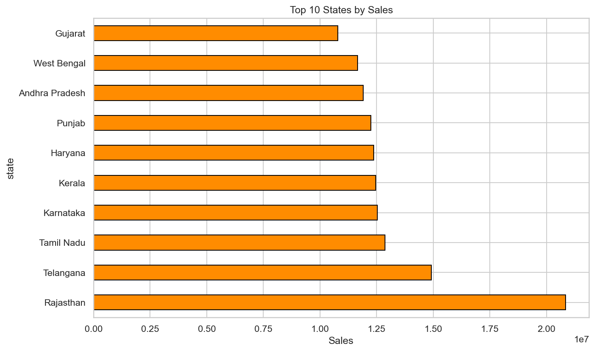

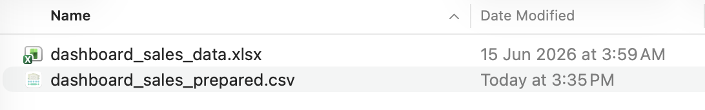

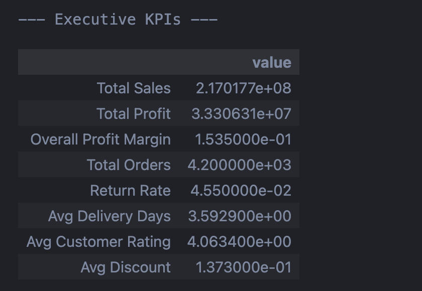

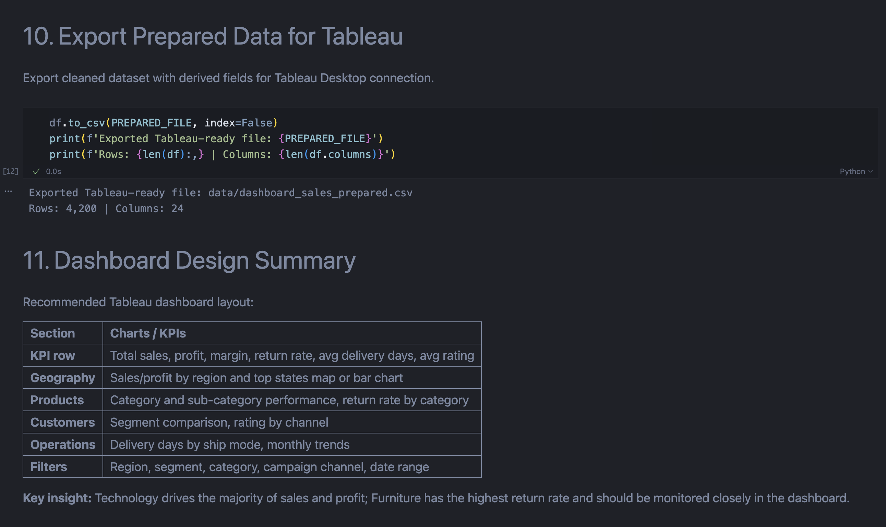

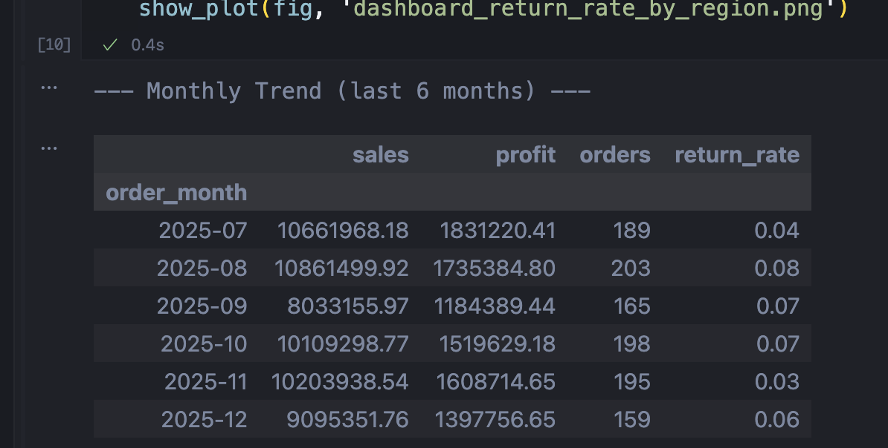

**To build the Tableau dashboard:**
1. Open Tableau Desktop.
2. Connect to `data/dashboard_sales_prepared.csv`.
3. Recreate charts using the notebook screenshots as layout reference.
4. Add dashboard filters and KPI cards as described in Section 11 of the notebook.
